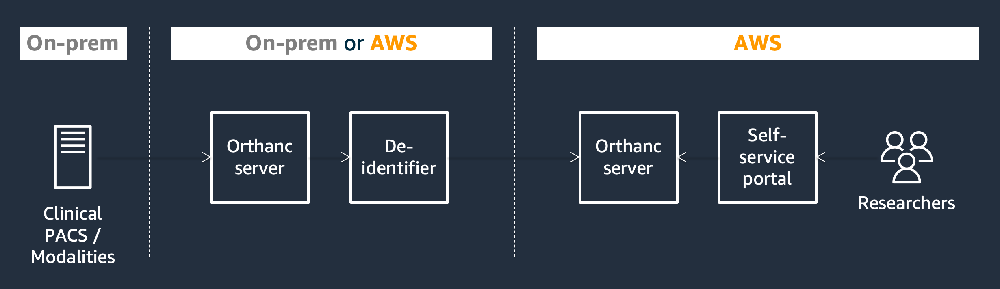

# Research PACS on AWS

* [Challenge to solve](#challenge-to-solve)
* [Solution presentation](#solution-presentation)
* [Deploy the solution](#deploy-the-solution)
* [Further reading](#further-reading)
* [Releases](#releases)
* [License](#license)

## Challenge to solve

The rise of new technologies in medical imaging, such as artificial intelligence, is an great opportunity to accelerate research and facilitate clinical improvements. This requires access to innovative services and computational capabilities, that the cloud can provide, as well as imaging and clinical data to support research studies.

Historically, it has been difficult for researchers to access medical images collected during the course of clinical care. This sometimes consists of a one-time, manual process where a clinical PACS (picture archiving and communication system) operator exports and shares images with a research team on a USB stick or a shared file server. Personal health information may persist in exported files, posing a privacy or compliance risk. Different research teams may also need access to different datasets, which requires to govern and enforce access rights to medical images.

## Solution presentation

This solution aims to provide an answer to this challenge. It facilitates secure and seamless access to medical images stored inside a clinical PACS for researchers. Potentially identifying information can be removed and medical images can be exported to Amazon S3 in order to leverage cloud capabilities for further processing.

### Key features

* End-to-end solution that can be fully deployed using AWS CloudFormation without additional coding
* Self-service portal accessible by researchers to browse, query and export DICOM files to Amazon S3
* Integration with the clinical PACS for image ingestion using any of the protocols supported by Orthanc (DICOM C-STORE, DICOMweb, Orthanc API, etc.)
* De-identification of original DICOM files based on transformation rules that you define in a YAML configuration file.
  * Possible transformations include shifting dates and times by a random number of days or seconds, replacing the value of `UI` data elements by randomly generated UUID, replacing data element values by random strings, adding or deleting data elements, transcoding DICOM files, and removing burned-in pixel annotations using manual coordinates or Amazon Rekognition
  * Storage of mappings between original values and replaced values, in order to maintain consistency of data element values across multiple DICOM instances (e.g. `StudyDate` should be replaced by the same value in two DICOM instances that belong to the same series)

* Storage of de-identified DICOM files in Amazon S3, a performant, scalable and cost-effective object storage service
* Multiple security features
  * Authentication using Amazon Cognito
  * Granular permissions to give research teams access to only a subset of DICOM files
  * Tracability of user activity in the self-service portal

### Screenshots

Click [Screenshots](doc/screenshots.md) to browse a selection of screenshots that illustrate the main features of the Research PACS on AWS solution.

### Simplified architecture

1. Your clinical PACS or your modalities are configured to automatically forward original DICOM files to the first Orthanc server, using one of the protocols supported by Orthanc (DICOM C-STORE, DICOMweb, Orthanc APIs).

2. The solution automatically detects and modifies new DICOM files to remove potentially identifying information about a patient, based on transformation rules that you define, and sends the de-identified DICOM file to the second Orthanc server.

3. Researchers use a self-service portal to browse, search and export de-identified DICOM files to Amazon S3. Researchers must authenticate to access the portal, and user activity is logged for auditability purposes. The solution also allows you to restrict access to a subset of DICOM files only, based on permission profiles that you attach to users or groups.

The solution consists primarily of Python scripts that run in Docker containers, that leverage notably [Flask](https://flask.palletsprojects.com/) for the self-service portal and [pydicom](https://github.com/pydicom/pydicom/) to manipulate DICOM files.

It also uses [Orthanc](https://www.orthanc-server.com/), a popular open-source PACS server, and its [Cloud Object Storage plugin for Amazon S3](https://book.orthanc-server.com/plugins/object-storage.html) to store and process DICOM files. For example, exporting a frame to a PNG file is done by calling an Orthanc API. Moreover, the solution can provide researchers with access to the underlying Orthanc server - the second Orthanc server - to take advantage of additional capabilities that may be offered by Orthanc Explorer or Orthanc plugins.

## Deploy the solution

### Deploy all components on AWS

This is the primary and easiest deployment pattern. Follow these [instructions](doc/deploy-all-aws.md) to provision the required resources using AWS CloudFormation, and configure the solution.

### Other deployment patterns

The first Orthanc server and the de-identifier can be deployed either on AWS, or on premises if you choose to send already de-identified data to the cloud. Moreover, if you already have an on-premises system to de-identify medical images, you can choose to not deploy the first Orthanc server and the de-identifier, and forward the medical images directly to the second Orthanc server.

Follow these [instructions](doc/deploy-others.md) to learn more about these other deployment patterns, and to get deployment instructions.

## Further reading

* [User guide](doc/user-guide.md)
* Solution architecture
  * [Detailed architecture](doc/detailed-architecture.md)
  * [PostgreSQL tables](doc/pgsql-tables.md)
* Deploying and operating the solution
  * [Deploy all components on AWS](doc/deploy-all-aws.md)
  * [Other deployment patterns](doc/deploy-others.md)
  * [Operate the solution](doc/operate.md)
* Configuring the solution
  * [De-identifier configuration file](doc/config-deidentifier.md)
  * [Permissions configuration file](doc/config-permissions.md)
  * [Environment variables](doc/environment-variables.md)
  * [Orthanc configuration file](doc/config-orthanc.md)
* Language references
  * [DICOM instance query](doc/dicom-instance-query.md)
  * [Tag path patterns](doc/tag-path-pattern.md)
  * [Tag paths](doc/tag-path.md)

## Releases

* [Release history](doc/releases.md)
* [Roadmap](doc/roadmap.md)

## License

This solution is licensed under the MIT-0 License. See the LICENSE file.

This solution depends on and may incorporate or retrieve a number of third-party software packages (such as open source packages) at install-time or build-time or run-time ("External Dependencies"). The External Dependencies are subject to license terms that you must accept in order to use this solution. If you do not accept all of the applicable license terms, you should not use this solution. We recommend that you consult your company’s open source approval policy before proceeding.

Provided below is a list of External Dependencies and the applicable license identification as indicated by the documentation associated with the External Dependencies as of Amazon's most recent review.

THIS INFORMATION IS PROVIDED FOR CONVENIENCE ONLY. AMAZON DOES NOT PROMISE THAT THE LIST OR THE APPLICABLE TERMS AND CONDITIONS ARE COMPLETE, ACCURATE, OR UP-TO-DATE, AND AMAZON WILL HAVE NO LIABILITY FOR ANY INACCURACIES. YOU SHOULD CONSULT THE DOWNLOAD SITES FOR THE EXTERNAL DEPENDENCIES FOR THE MOST COMPLETE AND UP-TO-DATE LICENSING INFORMATION.

YOUR USE OF THE EXTERNAL DEPENDENCIES IS AT YOUR SOLE RISK. IN NO EVENT WILL AMAZON BE LIABLE FOR ANY DAMAGES, INCLUDING WITHOUT LIMITATION ANY DIRECT, INDIRECT, CONSEQUENTIAL, SPECIAL, INCIDENTAL, OR PUNITIVE DAMAGES (INCLUDING FOR ANY LOSS OF GOODWILL, BUSINESS INTERRUPTION, LOST PROFITS OR DATA, OR COMPUTER FAILURE OR MALFUNCTION) ARISING FROM OR RELATING TO THE EXTERNAL DEPENDENCIES, HOWEVER CAUSED AND REGARDLESS OF THE THEORY OF LIABILITY, EVEN IF AMAZON HAS BEEN ADVISED OF THE POSSIBILITY OF SUCH DAMAGES. THESE LIMITATIONS AND DISCLAIMERS APPLY EXCEPT TO THE EXTENT PROHIBITED BY APPLICABLE LAW.

* Orthanc (https://www.orthanc-server.com/) - GPL-3.0
* Orthanc Cloud Object Storage plugins (https://book.orthanc-server.com/plugins/object-storage.html) - AGPL-3.0
