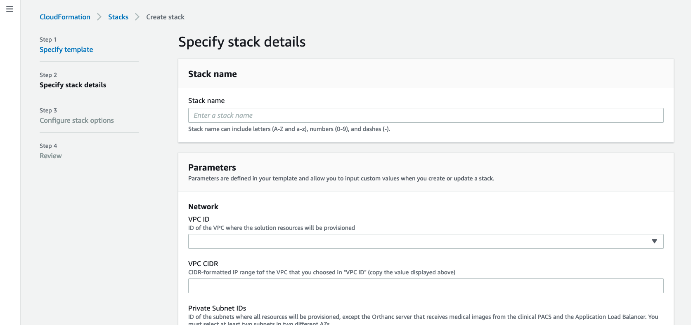

# Deploy All Components on AWS

This page goes through the steps to follow to deploy the solution in your AWS account.

## Step 1: Provision resources using AWS CloudFormation

You will use AWS CloudFormation to provision the required AWS resources. To proceed, create a new CloudFormation stack using the template that is provided in [`template.yaml`](../cfn-template/template.yaml). See [Creating a stack on the AWS CloudFormation console](https://docs.aws.amazon.com/AWSCloudFormation/latest/UserGuide/cfn-console-create-stack.html) for detailed instructions.

After uploading and specifying the CloudFormation template, you will need to specify a stack name and multiple parameters:

<kbd></kbd>

* In **Stack name**, enter a name with lowercase letters, numbers or dashes only (e.g. `research-pacs`). **Do not use uppercase letters**.

* You must specify a value or replace the default value for the following parameters:
  * **VPC ID**: You can choose the default VPC, or another VPC that you previously created
  * **VPC CIDR**: Enter the CIDR IP range of the VPC you selected above
  * **Private Subnet IDs**: Choose at least two subnets in two different availability zones where most of the resources will be provisioned. If you selected the default VPC above, choose two or more default subnets in this VPC.
  * **Orthanc Subnet IDs**: Choose at least two subnets in two different availability zones where the first Orthanc server will be provisioned (more exactly, the Network Load Balancer facing the Orthanc server). If you selected the default VPC above, choose two or more default subnets in this VPC. Otherwise, make sure to choose public subnets if the Orthanc server must be accessible from the Internet
  * **ALB Subnet IDs**: Choose at least two subnets in two different availability zones where the Application Load Balancer facing the self-service portal will be provisioned. If you selected the default VPC above, choose two or more default subnets in this VPC. Otherwise, make sure to choose public subnets if the self-service portal must be accessible from the Internet
  * **Cognito Domain**: You must enter a value that is unique for all Cognito customers in the region (e.g. `rpacs-7547394` is likely a unique value)
  * **Admin Username**: Username of the first user to create in the Cognito user pool
  * **Admin E-mail Address**: E-mail address for that user. Make sure to enter a valid e-mail address to receive the temporary password

* For all other parameters, you can leave the default value, or specify another value of your choice.

* Follow the on-screen instructions and wait for the stack creation to complete. The stack creation takes up to 30 minutes to complete.

* In the **Outputs** tab, note the following values:
  * **PortalURL**: The URL to the self-service portal
  * **OrthancURL**: The URL to the Orthanc server where original DICOM files must be sent (the first Orthanc server)
  * **BucketConfig**: The location of the configuration files in Amazon S3
  * **Orthanc1Config** and **Orthanc2Config**: The name of the SSM parameters if you'd like to customize the default Orthanc configuration

## Step 2: Customize the configuration files

In Step 1, AWS CloudFormation created an initial version of the de-identifier configuration file, and of the permissions configuration file. You should customize these files to your own needs.

### De-identifier configuration file

The configuration file is located at `{BucketConfig}/de-identifier/config.yaml`. By default, all incoming DICOM files are de-identified and sent to the Research PACS (second Orthanc server). The only rule applied is a `RandomizeUID` transformation that replaces the original value of all DICOM data elements `SOPInstanceUID`, `StudyInstanceUID` and `SeriesInstanceUID` by a random UID value.

To adapt the de-identifier configuration file to your own needs, review the [de-identifier configuration file](config-deidentifier.md) documentation, update the YAML file and upload the new version to the S3 bucket.

### Permissions configuration file

The configuration file is located at `{BucketConfig}/website/permissions.yaml`. By default, two profiles are defined: `Admin` which provides full access to the DICOM instances and to the underlying Orthanc server, and `ReadOnly` which provides access to all DICOM instances and read-only access to the Orthanc server. The profile `Admin` is assigned to the Cognito group `admin`, and the profile `ReadOnly` to the group `readonly`.

Review the [permissions configuration file](config-permissions.md) documentation to adapt the YAML file to your own needs, and upload a new version to the S3 bucket.

## Step 3: Test the solution

To test the solution:

* Retrieve the value of the secret `SecretOrthanc1` in AWS Secret Manager
* Connect to the Orthanc URL and authenticate (username = `awsuser`, password = value of the secret)
* Upload a new DICOM file by choosing **Upload** at the upper right corner
* Connect to the Portal URL and authenticate with the username that you provided as a parameter of the CloudFormation stack, and the temporary password that you received by e-mail.
* You should now have access to the self-service portal.
