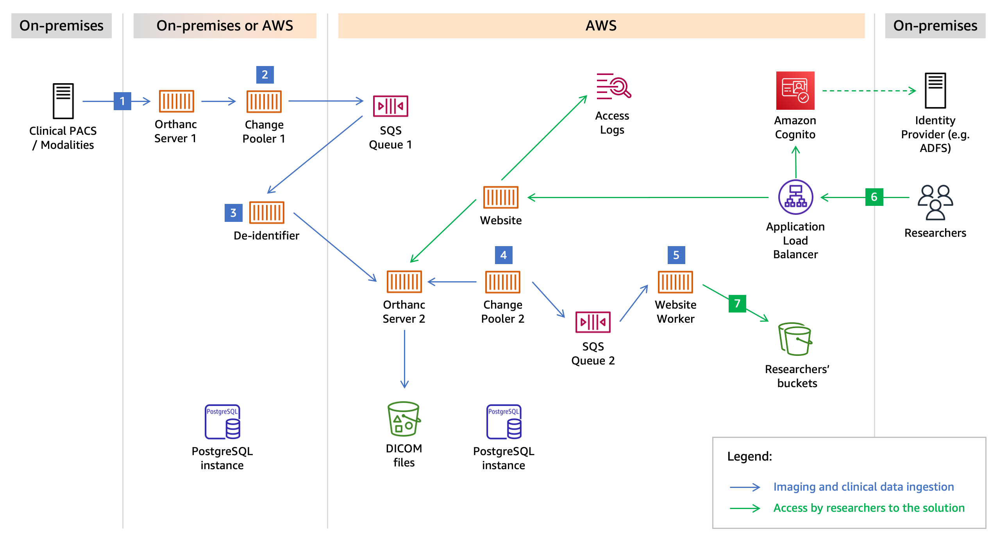

# Detailed Architecture

<kbd></kbd>

## Components

The solution is primarily composed of (not exhaustive):

* Two Orthanc servers that run in Docker containers
  * Orthanc is used to store and process DICOM files. For example, exporting a frame to a PNG file, or transcoding a DICOM file is done by calling an Orthanc API.
  * The first Orthanc server does not require persistent storage and can use ephemeral container storage
  * The second Orthanc server stores the index in a Aurora PostgreSQL database using the [official PostgreSQL plugin](https://book.orthanc-server.com/plugins/postgresql.html) and the DICOM files in Amazon S3 using the [Cloud Object Storage plugin](https://book.orthanc-server.com/plugins/object-storage.html)
  * This solution uses a custom Docker image derived from the Osimis Orthanc image. See the [Orthanc configuration page](config-orthanc.md) for further information.

* Multiple components that consist of Python scripts running in Docker containers:
  * The first and the second *change pooler* detects changes in Orthanc
  * The *de-identifier* that apply transformation rules
  * The *website* that serves the self-service portal. It leverages notably Flask.
  * The *website worker* that runs asynchronous tasks
  
* One Aurora PostgreSQL database to store the Orthanc index, and the data that other components must persist
* Two SQS queues to decouple components, and enable retries if one component fails
* An Application Load Balancer to serve and authenticate requests to the self-service portal using Amazon Cognito

## Workflow

**STEP 1**: Your clinical PACS or your modalities must be configured to automatically forward original DICOM files to the first Orthanc server, using one of the protocols supported by Orthanc (DICOM C-STORE, DICOMweb, Orthanc APIs). This first Orthanc instances stores the DICOM files until they are processed and removed by the *de-identifier*, which usually takes a few seconds. However, you can configure the *de-identifier* to not remove the original DICOM files from the first Orthanc server (see [Environment variables](environment-variables.md)).

**STEP 2**: The first *change pooler* regularly checks for changes in the first Orthanc server using the `/changes` API, detects new DICOM files, and sends a SQS message to the first SQS queue for each new DICOM file containing the Orthanc instance ID. The SQS messages only contain metadata about the Orthanc instance. The *change pooler* stores the last change ID detected in the PostgreSQL database, in order to recover from the last state if the *change pooler* restarts.

You can also manually send SQS messages in order to test new versions of the *de-identifier* configuration file, or to load DICOM files from Amazon S3 or a local file system without passing through the first Orthanc server (see [Updating an testing the configuration file](config-identifier.md#updating-and-testing-the-configuration-file) of the *de-identifier*). If the *de-identifier* fails to process a DICOM file, the corresponding SQS message returns to the queue and is made available again to the *de-identifier* for multiple retries.

**STEP 3**: The *de-identifier* receives SQS messages from the first queue and uses the [de-identifier configuration file](config-identifier.md) to apply labels to each DICOM file, determine whether it should be discarded or de-identified and sent to the second Orthanc server based on its labels, and apply transformations that you define in order to remove potentially identifying information.

Based on the configuration file, the *de-identifier* may store the mapping between the original value of a DICOM data element and the value by which it was replaced in the database. This allows to replace other occurences by the same value, if applicable.

If the pixel data must be altered, the *de-identifier* downloads a transcoded copy of the DICOM file to the Transfer Syntax 1.2.840.10008.1.2.1 (Explicit VR Little Indian) from the Orthanc server. This makes it easier to manipulate the pixel data using the Python library NumPy. The Orthanc server is also used to transcode the resulting DICOM file to another transfer syntax if needed.

**STEP 4**: The second *change pooler* regularly checks for changes in the second Orthanc server, and sends a SQS message to the second SQS queue for each new DICOM file, similarly to what is done in Step 2.

**STEP 5**: The *website worker* receives SQS messages from the second queue, generates and stores a JSON representation of the DICOM file into the PostgreSQL database. This JSON representation is used to make more granular and performant queries to the Research PACS, compared to querying the second Orthanc server directly. The *website worker* also regularly compares the list of DICOM instances stored in the second Orthanc server, and the list of DICOM instances for which a JSON representation is stored in the database. If a DICOM instance is removed from the second Orthanc server, the *website worker* automatically removes the corresponding JSON representation from the database.

**STEP 6**: The self-service portal is served by the *website* component. The *website* either generates pages such as the Search page, or forwards and proxies requests to the second Orthanc server. Researchers access the self-service portal through an Application Load Balancer that authenticate requests using Amazon Cognito. You can either store users and groups in a Cognito User Pool, or you can integrate an external identity provider to reuse existing identities. The permissions are defined in the [Pprmissions configuration file](config-permissions.md).

**STEP 7**: Researchers can export DICOM files to Amazon S3. When the form in the Export page is submitted, the *website* creates a new export task in the PostgreSQL database. The *website worker* detects that a new export task is pending, and creates a thread to export each DICOM file to the S3 bucket. The *website worker* uses the credentials provided by the user to obtain permissions to write to the specified S3 location.
