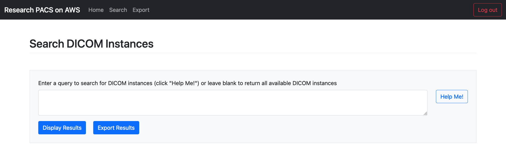
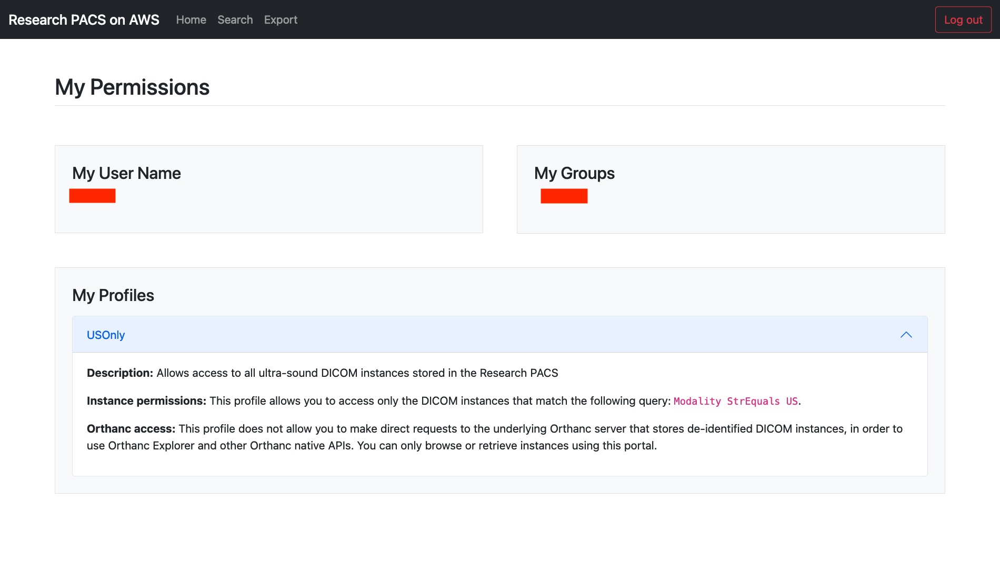
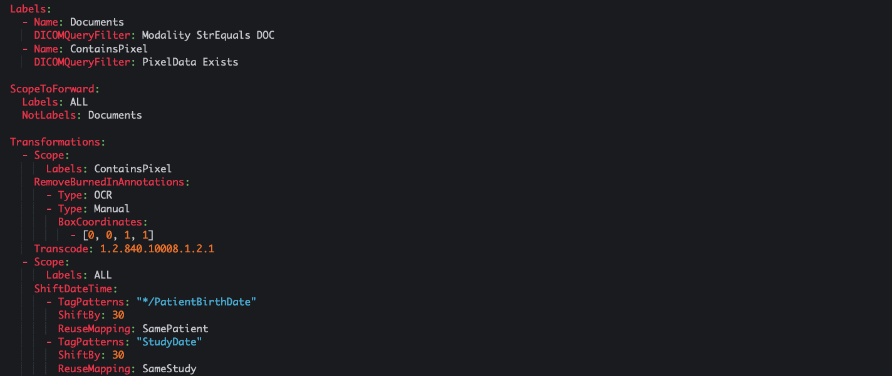
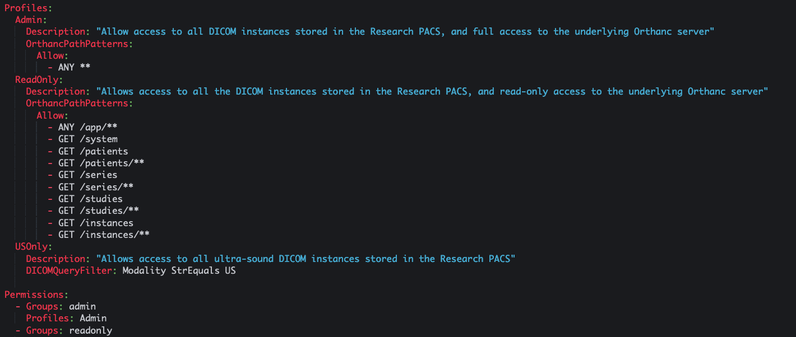

# Screenshots

## Self-service portal

Home page of the self-service portal that allows researchers browse, search and export medical images to Amazon S3:

<kbd></kbd>

Search page that allows researchers to specify a query and filter medical images in the Research PACS:

<kbd></kbd>

Search page with results displayed. Researchers can preview the DICOM file (data elements and frames) directly in the self-service portal:

<kbd></kbd>

Export page that allows researchers to export DICOM files in the format of their choice (DCM, PNG or JPEG) to a S3 bucket that they manage:

<kbd></kbd>

Permissions page that displays user permissions. The first screenshot shows the permissions of a user who is allowed to access all the medical images stored in the Research pages, and to make read-only requests to the underlying Orthanc server.

<kbd></kbd>

The second screenshot shows the same Permissions page for a user who is allowed to access the medical images acquired by `US` (ultrasound) modalities only:

<kbd></kbd>

## Configuration files

Example of the de-identifier configuration file that allows to define transformations applied to the original DICOM files in order to remove potentially identifying information:

<kbd></kbd>

Example of the the permissions configuration that allows to define permission profiles and assign profiles to the users and users' groups of the self-service portal.

<kbd></kbd>
