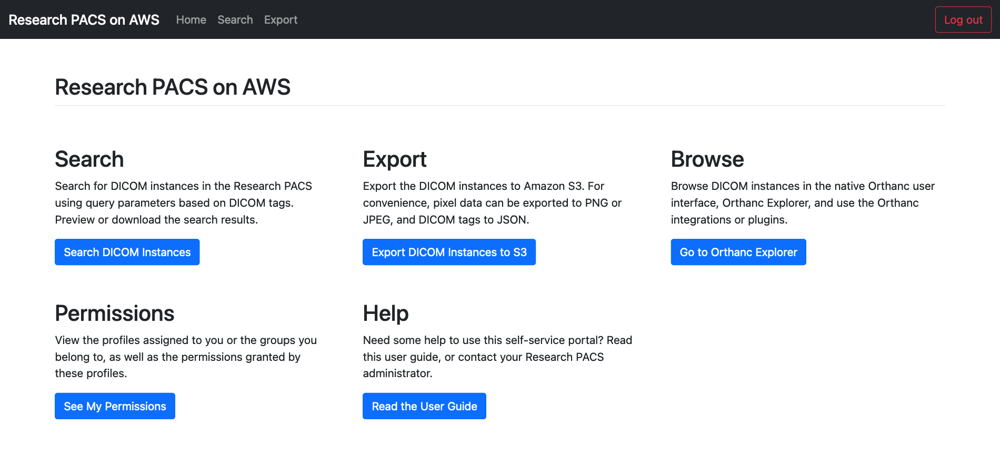
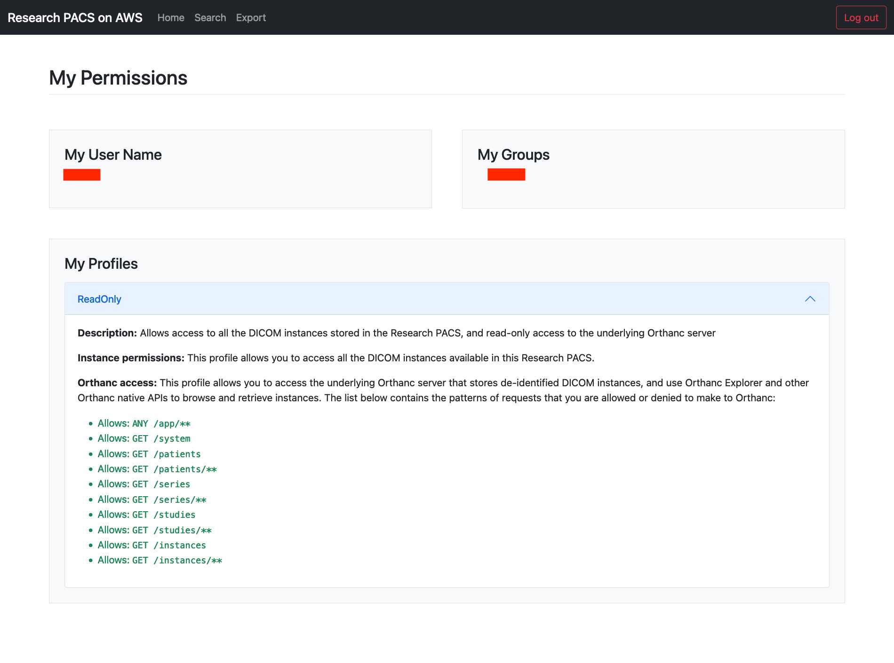
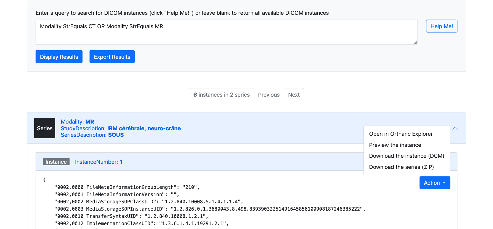
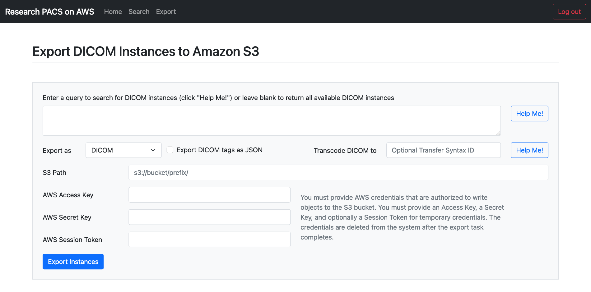
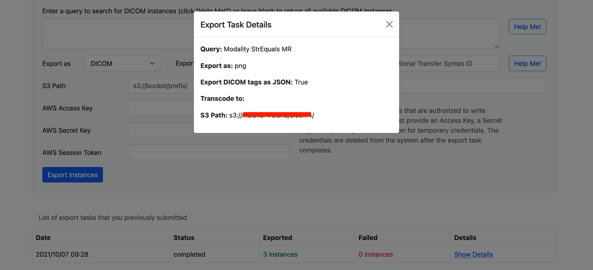

# User Guide

This is the user guide for the self-service portal of the [Research PACS on AWS solution](../README.md).

## Access

* Contact your Research PACS administrator to obtain the link to your Research PACS.
* You must authenticate to access the portal. Your Research PACS administrator will provide you with the necessary credentials.
* By default, users have no authorization on the portal. Contact your Research PACS administrator if you don't have any permissions, or if you feel that you need additional permissions.

## Pages

### Home Page

* The Home Page contains links to the other pages. Note that the "Browse" button will only appear if you have the required permissions.
* You can log out of the portal by choosing "Logout" at the upper right corner.

<kbd></kbd>

### Permissions

* This page displays your user name, your groups, and the profiles assigned to you by the Research PACS administrator.
* The profiles are cumulative: you can access a resource if at least one profile grants you permissions.

<kbd></kbd>

### Search

* This page allows you browse and search medical images stored in the Research PACS.
* You can enter a query in the textbox to filter the medical images (see [DICOM instance query](dicom-instance-query.md) for the language reference) or leave blank to display all the medical images that are available to you. Note that another user may obtain different results than you for the same query, if they have different permissions.
* Choose **Search** to display the results in the portal, or **Export** to export the list of matching DICOM instances, and a JSON representation of each matching DICOM instance without pixel or other binary data, in a JSON file.

<kbd></kbd>

### Export

This page allows you export medical images stored in the Research PACS to Amazon S3.

#### Creating an export task

* You can enter a query in the textbox to filter the medical images to export (see [DICOM instance query](dicom-instance-query.md) for the language reference) or leave blank to export all the medical images that are available to you. You can preview the results for a query in the Search page.
* In **Export as**, you can choose:
  * **DICOM** to export each DICOM instance as a DCM file. The file name will be `orthanc-instance-id.dcm`.
  * Or **PNG** or **JPEG** to export each frame of each DICOM file as an image. The file name will be `orthanc-instance-id_frame-number.png|jpeg`.
* Check **Export DICOM tags as JSON** to export a representation of the DICOM data elements in a JSON file. The file name will be `orthanc-instance-id.json`.
* In **Transcode DICOM to**, you can optionally enter a Transfer Syntax ID to transcode the DCM file exported to Amazon S3.
* You must provide AWS credentials whose permissions allow to put objects to the S3 bucket. The credentials are only used to write to the S3 bucket, and are not stored in the solution after the export completes. You can provide either:
  * An **AWS Access Key** and an **AWS Secret Key** if you have an IAM user
  * An **AWS Access Key**, an **AWS Secret Key** and **AWS Session Token** if you have temporary credentials

<kbd></kbd>

#### Viewing export tasks

At the bottom of the Export task, you can find the list of export tasks that you have created and additional details, such as the current status, the number of DICOM instances exported or that failed to export, etc.

<kbd></kbd>

### Browse

If your permissions profiles allow it, you can make requests to the underlying Orthanc server and use native Orthanc tools, plugins and features.
